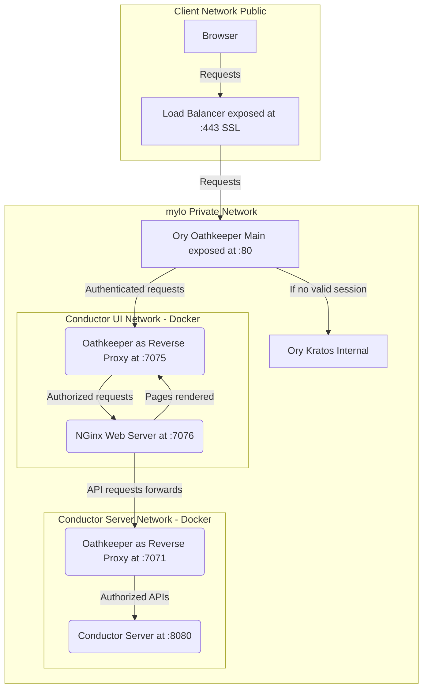

# conductor

[Netflix Conductor](https://github.com/Netflix/conductor) is a workflow 
orchestration tool that we in mylo utilise to run all major processes across 
various bounded contexts.

This component contains related configuration, docker setup for running 
Conductor for our process orchestration.

> Warning: Netflix Conductor is now not maintained by Netflix Engineering, 
> therefore, we utilise the [Orkes](https://orkes.io/) community edition 
> that is actively maintained and also allows for some cool features.

## Solution Architecture



1. The main Oathkeeper at outer network perimeter is ONLY reponsible for authentication.
2. Both Conductor Server and UI have separate deployment units (i.e. Dockers)
3. Both the server and ui are responsible for **authorizing** the incoming requests.
4. The Oathkeeper in Conductor UI **WILL NOT** authorize any API requests but 
will simply forward it as-is for the server to authorize.
5. All conductor authentication will be performed by internal Kratos connected
to B.TECH Azure Directory.

### Conductor UI

The conductor UI runs in a detached mode behind a reverse proxy provided by Oathkeeper.
Oathkeeper is responsible for ensuring any request coming to the UI is authenticated against
the Kratos Internal i.e. Sign In with BTECH Azure Account.

A single docker container will host both the react app and the reverse proxy, exposing 
only **port 7075**.

### Conductor Server

The conductor server runs in headless mode again behind a reverse proxy provided by Oathkeeper.
In this case Oathkeeper is responsible for ensuring any API requests coming in either from the
frontend or the worker polling is authorized, thereby using an Authorization Server.

A single docker container will host both the server and the reverse proxy , exposing 
only **port 7071**.

## Getting started

1. Place `conductor-server` in your `/etc/hosts` for local DNS resolution.
(See below)
```
##
# Host Database
#
# localhost is used to configure the loopback interface
# when the system is booting.  Do not change this entry.
##
127.0.0.1       localhost
255.255.255.255 broadcasthost
::1             localhost

## Mylo DNS 
127.0.0.1       conductor-server
```
2. Once done, spin up the docker compose stack from the root.
3. See the server running by viewing the Swagger Spec [http://conductor-server:7071/swagger-ui/index.html#/](http://conductor-server:7071/swagger-ui/index.html#/)
(Remember you placed a DNS resolution)
4. See the conductor UI [http://localhost:7075/](http://localhost:7075/)

### Conductor Logging

Conductor uses Log4J (an established logging library in Java Ecosystem). However 
the format is not JSON (it is yet structured).

> Initial thought is to pipe the log output to Logstash and output to OTEL.

### Conductor Metrics

Conductor is a [Java SpringBoot](https://spring.io/projects/spring-boot) 
application that exposes pre-defined metrics "Prometheus format" using
the [actuator feature](https://docs.spring.io/spring-boot/reference/actuator/metrics.html#actuator.metrics.export.prometheus).

Our Prometheus installation adds a scrape config to connect with conductor 
server metrics endpoint. See it in action [http://conductor-server:7071/actuator/prometheus](http://conductor-server:7071/actuator/prometheus).

## Why something like Conductor and not just HTTP

In the full mylo context, there is a need of having long running durable 
processes. E.g. a checkout or interest calculation EOD are long running 
processes across various **distributed systems**. The key here is distributed.

Thise those cases just random, trivial HTTP doesn't help, because as a financial
product we need failure handling, recovery, immutability, and many others.

Hence the need of utilising a pattern that provides all of these is imminent.


## Why orchestration and not choreography or other patterns to achieve the same

Orchestration, Choreograpgy, Saga pattern are all well-defined patterns that can
help us in achieving what we need as a distributed transactional system. Yet the 
differences in building and managing those has been the key to select Orchestration
over any other.

Please read the nice article [from Camunda](https://camunda.com/blog/2023/02/orchestration-vs-choreography/) 
which details out the differences.

For us, the choice of orchestration pattern over cheoreography was mainly
driven by:

1. Simplicity to setup and manage
2. Centralised control
3. Easy troubleshooting
4. High-churn in changes

## What are the other tools that we evaluated

1. [Camunda Business Process Engine](https://camunda.com/) - Simply a great engine
to design and orchestrate business processes. Even has a cloud-native version 
[Zeebe](https://camunda.com/platform/zeebe/). However the learning curve is huge and
it expects everyone / engineers to know how to design processes in industry standard 
[BPMN](https://en.wikipedia.org/wiki/Business_Process_Model_and_Notation).
2. [Activiti](https://www.activiti.org/) - a precursor to Camunda offering an open source
process automation. Also the learning curve is huge.
3. [Temporal](https://temporal.io/) - New kid on the block, high performance Golang binary
based workflow orchestrator. The only reason to not select it is that the definition
is all in code which non-tech users have difficulty in visualising. Still this
has the potential to replace Conductor in future.