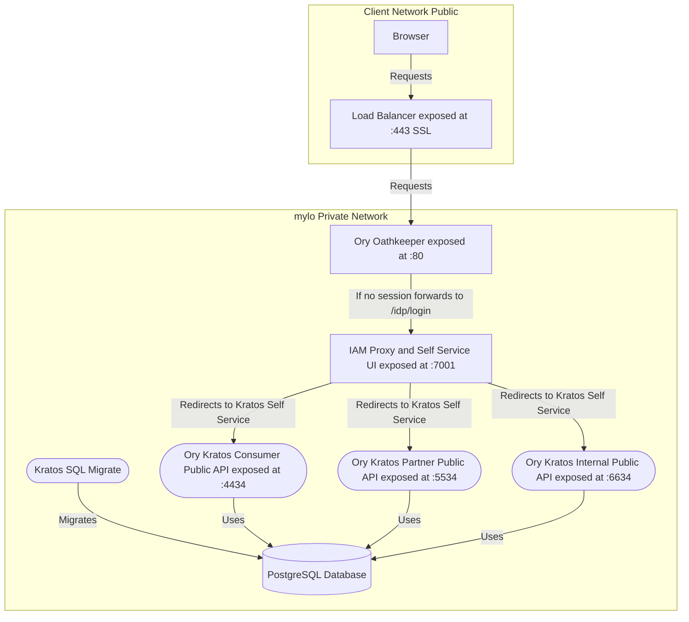

# iam-proxy

IAM Proxy is a service that acts as a proxy between the client and the identity
and access service. It is responsible for providing all the APIs needed by
external clients or even internal services to interact with the underlying services.

:blue_book: There will be no direct access to any of the underlying services responsible
for managing the identity and access of the users. All the requests will be proxied via the
APIs provided by the proxy.

## Overview

We utilise [Ory modules](https://www.ory.sh/docs/welcome) for managing the identity and
protecting our APIs. The following services are used:

1. [Ory Hydra](https://www.ory.sh/docs/hydra/) - OAuth2 and OpenID Connect Server
2. [Ory Kratos](https://www.ory.sh/docs/kratos/) - Identity and User Management
3. [Ory Oathkeeper](https://www.ory.sh/docs/oathkeeper/) - Identity and Access Proxy

Also read [Ory's Architecture Principles](https://www.ory.sh/docs/ecosystem/architecture-principles/)

The IAM Proxy is responsible for the following concerns only:

1. Hosts a self-service UI for login, registration, verification
2. Provides APIs and services for access management

### Solution Architecture



mylo has 3 specific user groups: Consumer, Partner and Internal back-office users. Each of these
user groups have their own set of needs when it comes to identity management.

1. Consumer can create accounts via mobile phone
2. Partner identities are created via emails
3. Internal back-office to use Azure AD and identity federation

Ory provides the concept of Organisations that allows to configure different schemas and configs
for each of the user group, yet, Organisations is only available on paid editions.

With Open Source Edition, it is a common practice to run each instance with a sspecific
set of configurations (verified on Ory Slack channel and being used by many adopters)

## Getting Started

Starting the IAM stack including all of the Ory components requires Docker installed
on your environment.

1. Ensure to update your `/etc/hosts` (on Mac and Linux) to include the following entries:

    ```shell
    127.0.0.1       consumer.myloapp.local
    127.0.0.1       partner.myloapp.local
    127.0.0.1       idp.consumer.myloapp.local
    127.0.0.1       idp.partner.myloapp.local
    ```

2. Run `npm run install` to fetch all the dependencies
3. Head over to `./docker` and execute `docker compose up -d` to spin up Ory stack
4. Run `npm run start:dev`

Now the self-service portals are available at:

1. [Consumer Self Service](http://idp.consumer.myloapp.local:7001)
2. [Partner Self Service](http://idp.partner.myloapp.local:7001)
3. [Internal Self Service - TBA](http://idp.internal.myloapp.local:7001)

## Configuration and ENV vars

## API References

## Dependencies

## Testing

## Deployment

## Contributing

## Changelog

## Security

## FAQ
