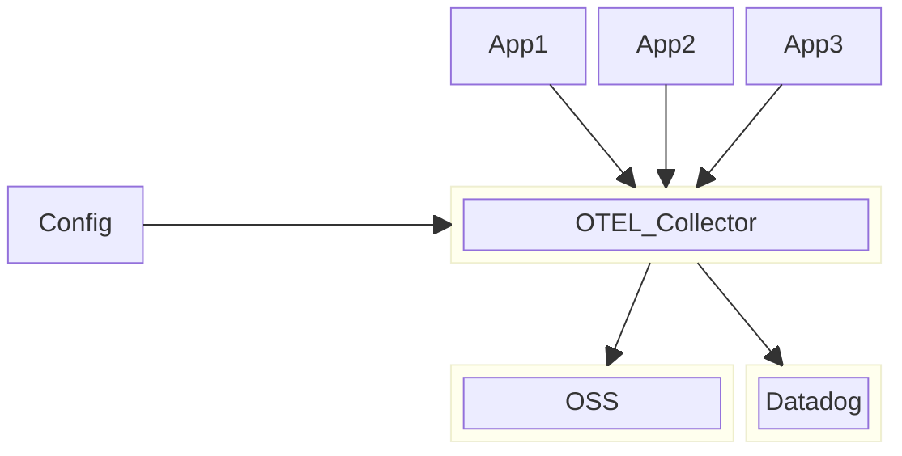

# Observability Solution Architecture

## Introduction

Observability has become a crucial aspect of modern software systems, enabling organizations to gain insights into the behavior of their applications and infrastructure in real-time. OpenTelemetry, a CNCF (Cloud Native Computing Foundation) project, has emerged as a powerful standerd for achieving comprehensive observability in distributed systems. This document outlines an observability solution architecture leveraging OpenTelemetry in the aim of focusing on the integration between the monitored systems and the visualization tools used.

Refere [here](https://opentelemetry.io/docs/specs/otel/ ) for OpenTelemetry specification document. 

## What Is OpenTelemetry?

### **1. Introduction to OpenTelemetry:**
OpenTelemetry is an open-source project designed to provide a unified set of APIs, libraries, agents, and instrumentation to capture telemetry data such as traces, metrics, and logs. It emerged from the merger of OpenTracing and OpenCensus projects to address the need for a cohesive and standardized approach to observability in distributed systems.

### **2. Key Components of OpenTelemetry:**
- **Instrumentation Libraries:** OpenTelemetry offers language-specific instrumentation libraries for popular programming languages such as Java, Python, Go, and others. These libraries facilitate the automatic generation of telemetry data within applications.
- **OpenTelemetry Collector:** The collector acts as a centralized component responsible for receiving, processing, and exporting telemetry data. It supports various data formats and protocols, allowing seamless integration with existing monitoring and observability systems.
- **Exporters:** OpenTelemetry provides exporters to transmit telemetry data to backend systems such as distributed tracing platforms, time-series databases, and log management solutions. Exporters support multiple formats, including OpenTelemetry Protocol (OTLP), Jaeger, Prometheus, and others.
- **Context Propagation:** OpenTelemetry ensures the propagation of context across distributed components, enabling correlation of telemetry data generated by different microservices within a transaction or request.

### **3. Integration with Observability Architecture:**
- **Tracing:** OpenTelemetry enables distributed tracing, allowing the visualization and analysis of the flow of requests across multiple services. Traces provide insights into the latency, dependencies, and performance bottlenecks within the system.
- **Metrics:** By leveraging OpenTelemetry metrics, organizations can collect and analyze quantitative data about the performance and behavior of their applications. Metrics help in monitoring resource utilization, service-level objectives (SLOs), and key performance indicators (KPIs).
- **Logs:** OpenTelemetry logging capabilities facilitate the collection and aggregation of logs from various sources, enabling troubleshooting, debugging, and auditing of applications and infrastructure.

## Observability Pillars:
- **Logs:** records of events or actions that occur within a software application or system. These records typically include information such as timestamps, severity levels, and details about what happened. 
- **Traces:** refer to records of the execution path or flow of a program, system, or transaction. Traces provide a detailed account of how a specific operation or request traverses through various components or services within a software system.
- **Metrics:** refer to quantitative measurements or indicators used to assess various aspects of software development, system performance, and user experience. 

## Guiding Principles

- **This solution is indepedent of the stack used for building**
- **The stack used for building the solution must support the opentelemetry standard**

> **Note:** These guiding principles should be translated into separate ADR documents.

## Mylo Solution Architecture Reference

Refer [here](https://btechlabs.atlassian.net/wiki/spaces/OPENLOOP/pages/283279394/Solution+Architecture+Guidelines) for Mylo's solution architeture documentation.

## Architecture Diagram

## Components of the Architecture

### Application Layer

The application layer represents the systems we are trying to monitor. These systems are considered to be our main source for logs, traces, metrics,....etc

### Opentelemetry(OTEL) collector

This part of the solution is responsible for collecting the datapoints from the application layer and according to a the given configuration produces it to the the target APM platform. The main purpose of it is to act as an abstraction layer between your application and the targeted platform so that whenever you decide you want to change your this platform, you are only updating the configuration of this layer without having to do any modifications to your application layer.

### Application Performance Monitoring Platform

This is the part resposible for receiving performance data from OTEL collector and give us the capability of monitoring and diagnosing our application by providing insights about various aspects of application performance, such as response time, resource usage, error rates, and transaction traces...etc. Example of such platform would be OSS/or Datadog.

Though this solution is independent on the the APM Platform used, we however recommend starting with an OSS solution, especially putting into consideration the following 2 aspects:

- Cost. Since this is an open source solution (free of charge), you can immediately deploy it for use on all of your enviroments without having to worry about the process of licsence aquiring or budget. 
- As a new team with a new product, we would like to control how and which metrics to start with until we reach a maturity level. At that point together with central platform team we will make a decision towards Datadog or continue with our solution.

One OSS choice we can go for is the grafana stack which make uses of the following components:

- **Loki:** a log aggregation system designed to store logs efficiently and query them efficiently.

- **Prometheus:**  monitoring system and time-series database that collects metrics from monitored targets.

- **Tempo:**  distributed tracing backend that receives trace data and provides querying capabilities.

### Data Analysis and Visualization 

This part of the solution represents the physical goal of applying observability, which is to be able to do data analysis on the collected datapoints(metrics, logs,...etc).

## Conclusion

Incorporating OpenTelemetry into the observability solution architecture empowers organizations to gain deeper insights into the performance, reliability, and security of their distributed systems. By standardizing telemetry instrumentation and collection, OpenTelemetry facilitates effective monitoring, troubleshooting, and optimization of cloud-native applications.

