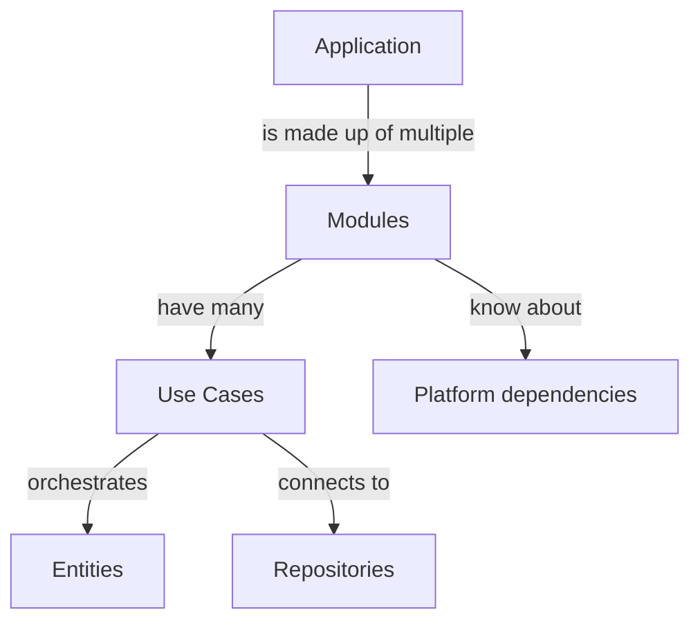
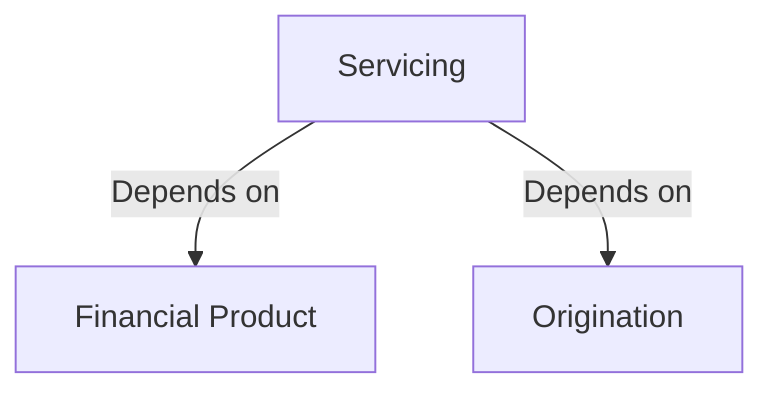

# lms-lite

lms-lite is a self-contained system that exposes the capabilities for Financial 
Services and Management together with capabilities from the Lean core. See 
[enterprise capability map](to-be-added.com).

- [Stack and components](#stack-and-components)
- [Makefile](#makefile)
- [Getting started locally](#getting-started-locally)
- [CLI](#cli)
- [Code structure](#code-structure)
- [Assets (and File IO)](#assets-and-fileio)
- [GitHub Actions](#github-actions)
- [Structurizr and C4 Model](#c4-model-and-structurizr)

## Stack and components

The runtime for this project needs the infrastructure components which are
provided by the [docker-compose.yml](./docker/docker-compose.yml) file. You 
need [Docker](https://www.docker.com/) installed together with [docker-compose](https://docs.docker.com/compose/install/).

> MacOS users already have both Docker and Compose installed via the Docker App.

| Stack    | Description                                                                   |
|----------|-------------------------------------------------------------------------------|
| Orkes    | Netflix Conductor fork for managing and running workflows                     |
| Postgres | RDBMS primary persistence providing storage capacity to the project and Orkes |
| Redis    | Key-Val in-memory cache and messaging providing support to the project        |

## Makefile

This project uses [Makefile](./Makefile) to run commands and also simulate CI
pipeline. Have a look there once before you start.

Run `make help`:

```shell
Usage:
  make <target>

Targets:
  Build:
    build               Build your project and put the output binary in out/bin/, see GOOS arch details https://go.dev/doc/install/source#environment
    clean               Remove build related file
    vendor              Copy of all packages needed to support builds and tests in the vendor directory
  Test:
    generate-mocks      Generate mocks for the interfaces in the project, required for testing
    test                Run the tests of the project
    coverage            Run the tests of the project and export the coverage
  Lint:
    lint                Run all available linters
    lint-dockerfile     Lint your Dockerfile
    lint-go             Use golintci-lint on your project
    lint-yaml           Use yamllint on the yaml file of your projects
  Docker:
    docker-build        Use the dockerfile to build the container
    docker-release      Release the container with tag latest and version
  Help:
    help                Show this help.
```

### Running Database Migrations

We use [Sqitch](https://sqitch.org/) for database migrations. You can install it
from the [official website](https://sqitch.org/download/)

You can also use Sqitch Docker image to run the migrations. 

To run the migrations, you can use the following commands:

```shell
sqitch deploy db:pg://postgres:postgres@localhost:5432/lms_lite
```

or, if you have the `Makefile` and Docker installed, you can use the following command:

```shell
EXPORT SQITCH_TARGET=db:pg://<user>:<password>@<host>:<port>/lms
make db-migrate
```


## Getting started locally

As a developer or QA (basically as tech), you must have the following installations:

1. Docker (and docker compose)
2. Golang
3. Git
4. [Sqitch](https://sqitch.org/download/) for database migrations 
5. [Golangci-Lint](https://golangci-lint.run/usage/install/) for linter only if you run `make lint-go`

In order to start:

Run the docker compose from `docker/`: `docker-compose up -d`. This will start all the platform services: 
- postgres (5432), 
- orkes (5001 & 8080) and 
- redis (6379)

Run `make generate-mocks` to generate mocks for the interfaces in the project.

Now, you can use the CLI commands to spin up whatever you want. See the CLI section for more details.

## CLI

TO BE ADDED

## Code structure

We follow a modular structure to set up our code in this repository. Each of these modules exposes certain capabilities
from the enterprise domain map.

Currently, we have the following modules:

| Module           | Description                                                                        |
| ---------------- | ---------------------------------------------------------------------------------- |
| financialproduct | Design of financial product and financial calculations                             |
| origination      | Process of creating a loan application and finally activating a loan via servicing |
| journal          | Sub-Ledger to hold accounting entries having financial impact                      |
| servicing        | All operations needed to manage an activate loan lifecycle                         |

We also utilise the benefits of having a "modular monolith" with certain very specific considerations:

- Every business logic (not orchestration logic) lies in the module domain entity
- The use case (or call it a service layer in old world) is only for orchestration e.g. call db, update entity, save
- The use case will not hold any business logic or transactional logic
- Then we have a repo layer that always takes in a business entity and always gives back a business entity. 
- The internal details of how many tables the entity is distributed never leaves the repo.
- From the onion model arch, the outer layers know about the inner model but not the other way round, meaning the outer layers will not perform logic on inner models
- The top most layer (either HTTP handler or Conductor Task) is always responsible for getting the incoming data, verifying the authenticity only

Below is our code structure for each of the modules:

```
├── assets      
│	├── coa
│	└── financial_products
│	└── env.yaml            ## Env YAML
├── cmd                     ## Holds the CMDs / CLI
├── config                  ## Env Config loader
├── docker                  ## docker-compose only for various setups
├── docs                    ## Docs
├── migrations              ## Migration for DB, later for workflow tasks
│	└── db
├── modules                 ## Modules folder
│	├── financialproduct    ## Module: financialproduct
│	│	├── domain
│	│	├── dto
│	│	├── repository
│	│	└── usecase
│	│	└── module.go       ## Module orchestrator which setsup all dependencies needed by the module
│	├── journal
│	├── origination
│	└── servicing
├── pkg                     ## Utility functions, common packages
```

How things are orchestrated:



## Module dependencies



## Assets (and fileIO)

Golang's file IO is rather different from the ones we are used to when working
with languages like Java/.Net. It is because in Golang, the executable does not
contain the file itself by default. See how Golang solves it by [embed](https://pkg.go.dev/embed)
package.

However, it is not a good practice to read the files and put them into the executable
and thus, we rely on utilising an external `assets` folder location to store all
the files (e.g. `.env`, any static mapping or config file) and pass the absolute
path when executing the go `main` or `test`. This ensures that these files can
also be sourced externally e.g. from GitHub or S3 (later).

Remember, how Linux stores the configuration at a different location than the executable
itself. Config stay at `/etc/<name>` v/s the binary is at `/usr/local/bin` (for example)

When starting a `main` function locally:

- Use (if in root): `ASSET_DIR_ABSOLUTE_PATH=$(pwd) go run cmd/task-runner/main.go`
- For test: `ASSET_DIR_ABSOLUTE_PATH=$(pwd) go test ./...`

If you use the `Makefile` command from the root, these are already included.

## GitHub Actions

We use GH Actions for running our pipelines. See [files](./.github/workflows).

Run GH Actions locally via [act](https://github.com/nektos/act) and test them.

## C4 Model and Structurizr

We use C4 model to document our system architecture and dependencies. Structurizr as an implementation
of the C4 model, see [workspace.dsl](./docs/workspace.dsl)

To run it locally, use:

```shell
docker run -it --rm -p 8080:8080 -d \
  --name=structurizr \
  -v <Your_Path>/lms-lite/docs:/usr/local/structurizr structurizr/lite
```

Then log in to [localhost:8080](localhost:8080) to view the generated diagrams.


